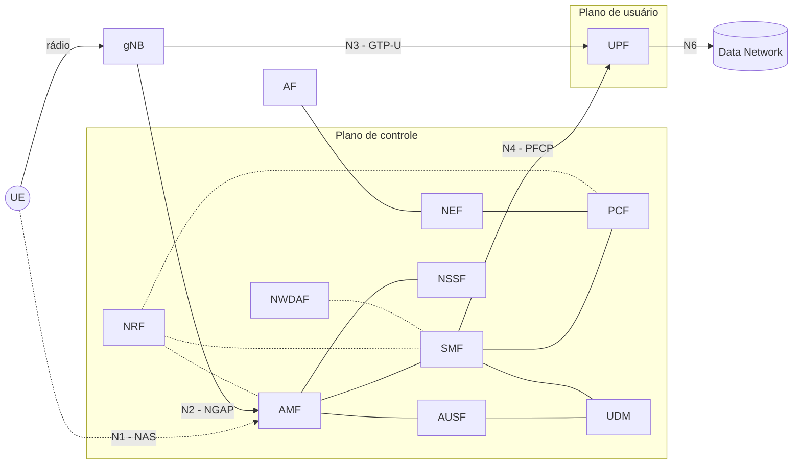
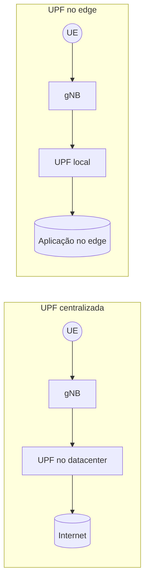
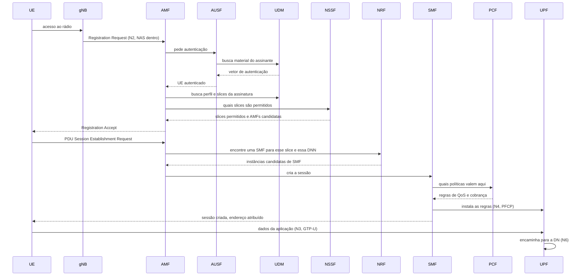
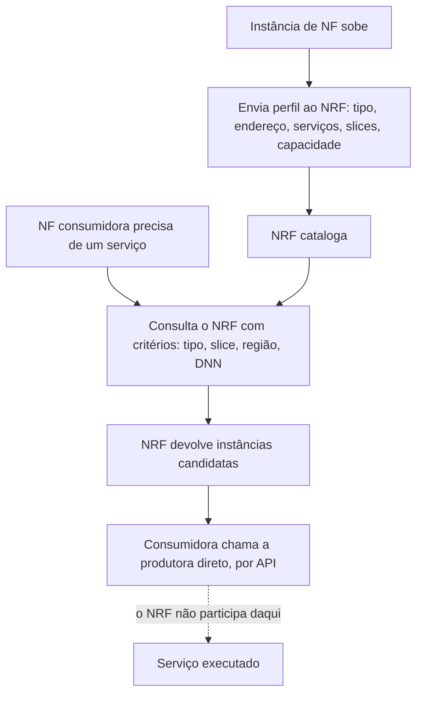
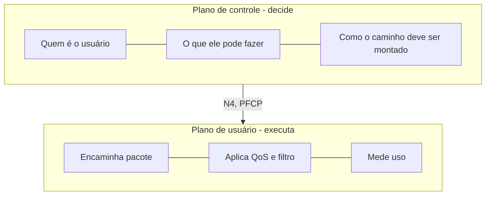
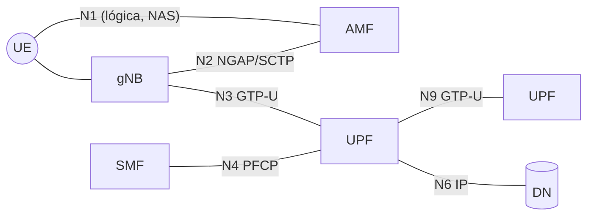

Feito por IA para exemplificar (entender melhor com exemplos de um hotel)
Diagramas para melhor entendimento
## O que a atividade está cobrando
A atividade tem três partes que parecem repetidas mas não são. O exercício 1 pede para eu descrever cada função por seis ângulos, o exercício 2 me obriga a comprimir isso numa linha de tabela, e o exercício 3 testa se eu sei separar as confusões clássicas. A coluna que carrega a atividade inteira é a última, "não faz". Decorar que o AMF cuida de mobilidade é fácil, o que separa quem entendeu de quem decorou é saber que o AMF não toca no pacote da aplicação.
## Mapa geral do 5G Core

Repara numa coisa: só uma seta grossa atravessa a figura de ponta a ponta carregando dado de verdade, que é gNB -> UPF -> DN. Todo o resto é conversa sobre essa seta. É essa a imagem que precisa ficar na cabeça.
## A analogia que uso pra não misturar as funções
Penso no Core como um hotel grande. O hóspede é o UE.

| Função | No hotel | O que isso quer dizer na rede |
| --- | --- | --- |
| AMF | recepção | recebe você, faz o check-in, sabe em que andar você está e cuida quando você troca de quarto |
| AUSF | o segurança que confere o documento | verifica se você é você mesmo |
| UDM | a ficha de cadastro | guarda seus dados, seu plano, o que você tem direito |
| PCF | as regras da diária | decide se você tem café da manhã incluso, se pode usar a piscina, o que entra na conta |
| SMF | o gerente de andar | monta o quarto, define por qual corredor você vai passar e avisa a manutenção o que fazer |
| UPF | o corredor e o elevador | é por onde você e suas malas realmente passam |
| NRF | o quadro de plantão | diz quem está de serviço agora e onde encontrar |
| NSSF | quem decide a ala | te manda pra ala executiva ou pra ala econômica |
| NEF | a portaria de fornecedores | única porta pra quem é de fora |
| AF | o fornecedor de fora | pede coisas, mas não manda em nada |
| NWDAF | o setor de dados | analisa a ocupação e prevê a demanda do mês que vem |

A analogia quebra em um ponto e é bom saber onde: no hotel a recepção às vezes carrega a mala. No 5GC nunca. O AMF é rigorosamente proibido de tocar no tráfego do usuário, e essa proibição é arquitetural, não é detalhe de implementação.
## Por que cada resposta do exercício 1 ficou assim
### AMF, a porta de entrada
Toda vez que o celular liga, quem ele procura no Core é o AMF. Ele é o destinatário lógico das mensagens NAS, que é o canal direto entre UE e Core: o gNB transporta essas mensagens mas não lê o conteúdo delas.

O detalhe que a atividade quer pegar está na autenticação. O AMF coordena, mas quem executa é a AUSF, com o material que vem da UDM. Se eu responder que o AMF autentica, erro.
### SMF, o arquiteto da sessão
O SMF é a função mais fácil de descrever errado, porque tudo que ela faz aparece como se fosse dado. Ela seleciona a UPF, define a regra de encaminhamento, configura QoS, atribui endereço ao UE. Mas ela nunca vê um pacote da aplicação.

Uso essa imagem: o SMF é o engenheiro que projeta a estrada e decide onde ficam as faixas e o pedágio. O carro que passa é problema da UPF.
### UPF, onde o dado realmente anda
A UPF é a única função de peso do plano de usuário e é a única que pode sair do lugar. Isso é o mais interessante dela. As outras funções ficam onde o operador quiser porque sinalização não é sensível a alguns milissegundos a mais, mas a UPF define a latência que o usuário sente, então quando a aplicação exige resposta rápida a UPF desce pra perto da antena.

Caso real: uma fábrica com rede privativa 5G controlando AGV. Se a UPF está num datacenter a 400 km, o comando do controlador vai e volta atravessando o backhaul e a latência estoura o orçamento do URLLC. Com a UPF instalada dentro da própria planta, o pacote nem sai do chão de fábrica. Mesma rede, mesmas funções, o que mudou foi onde a UPF ficou.
### PCF, UDM e AUSF
Essas três costumam embolar porque todas parecem "coisa de cadastro". A separação fica clara se eu perguntar o que cada uma responde:
- UDM -> quem é esse assinante e o que ele contratou
- AUSF -> essa pessoa é mesmo quem diz ser
- PCF -> dado o que ela contratou, que tratamento a rede dá ao tráfego dela agora

Na vida real: você contratou um plano com franquia de 30 GB e vídeo em alta. A UDM guarda que o plano é esse. A AUSF confirma na hora que o chip é seu. A PCF é quem manda reduzir a taxa quando a franquia acaba, e é ela também que alimenta a lógica de cobrança. A UPF é quem efetivamente aplica o limite no tráfego, porque a PCF não encosta em pacote.
### NRF e NSSF
São as duas funções que só existem porque o 5GC é virtualizado. Em rede física de 4G não faz sentido perguntar "onde está o MME", ele está no rack. Já no 5GC podem existir seis instâncias de SMF criadas automaticamente na hora do pico e três delas somem à noite.
### NEF, AF e NWDAF
Essas três eu trataria como a camada de fora do Core. A AF é a voz da aplicação, a NEF é a porta que ela usa, o NWDAF é o que a operadora usa pra enxergar a própria rede. Um exemplo concreto de AF: uma plataforma de nuvem para jogos pede que o tráfego daquela sessão receba prioridade e seja roteado para o edge mais próximo. Ela não impõe nada. Ela pede à NEF, a NEF valida e traduz, a PCF decide, o SMF configura e a UPF executa. Cinco funções para atender um pedido, e cada uma só faz a sua parte.
## O celular ligando, passo a passo
Esse diagrama é o que amarra a atividade inteira. Ele mostra a ordem em que as funções entram.

Duas coisas que esse fluxo ensina e que a tabela sozinha não ensina:
- a sessão PDU só nasce depois do registro. São dois procedimentos distintos, e é por isso que AMF e SMF são funções separadas
- a UPF entra por último e é a única que continua trabalhando depois. Todo o resto foi preparação
## Como a descoberta pelo NRF funciona
Vale destrinchar porque é a pergunta 4 do exercício 3.

A parte que quase todo mundo erra é a linha pontilhada. O NRF é páginas amarelas, não é central telefônica. Ele te dá o endereço e sai da conversa. Se ele ficasse no meio de toda chamada viraria gargalo e ponto único de falha da rede inteira.

Comparação que ajuda: é o mesmo papel do service discovery em arquitetura de microsserviços, tipo um Consul ou o registro do Kubernetes. O 5GC não inventou esse padrão, ele importou de software, e isso é literalmente o significado de "arquitetura baseada em serviços".
## A separação dos planos, que é o ponto da aula

Por que separar rende tanto:
- escala independente. Numa rede de IoT com milhões de medidores, o volume de sinalização é enorme e o volume de dado é ridículo. Aí a operadora sobe mais AMF e quase nenhuma UPF. Já numa rede que só serve streaming acontece o contrário
- a UPF pode ir pro edge sem arrastar o Core junto
- slicing fica viável, porque dá pra ter UPFs dedicadas por slice com o mesmo conjunto de controle
- e o inverso também vale: se controle e dado andassem juntos, cada nova exigência de latência obrigaria a mover a rede inteira

Essa é a mesma lógica que o 4G já vinha tentando com CUPS, só que no 5G ela nasceu na arquitetura em vez de ser remendada depois.
## As interfaces, lidas pelo diagrama

Um jeito de nunca mais errar: número ímpar baixo tende a ser dado do usuário atravessando (N3, N9), N1 e N2 são controle, N4 é o controle mandando no dado, N6 é a saída pro mundo. E a N1 é a única que não é um enlace físico, é uma relação lógica entre UE e AMF que anda dentro da N2 na prática.
## Comentando o exercício 3
As duas primeiras perguntas são de reconhecimento direto, SMF e UPF, e não têm truque nenhum. As outras três são as armadilhas de verdade:
- UDM x AUSF separa dado de procedimento. Quem guarda não é quem verifica
- a importância do NRF só aparece se eu aceitar que a topologia do 5GC é dinâmica. Se eu ainda penso em caixas fixas, o NRF parece inútil
- a N4 é a pergunta que resume a aula, porque ela é o ponto exato onde o plano de controle encosta no plano de usuário. É a única interface da atividade que atravessa a fronteira entre os dois
